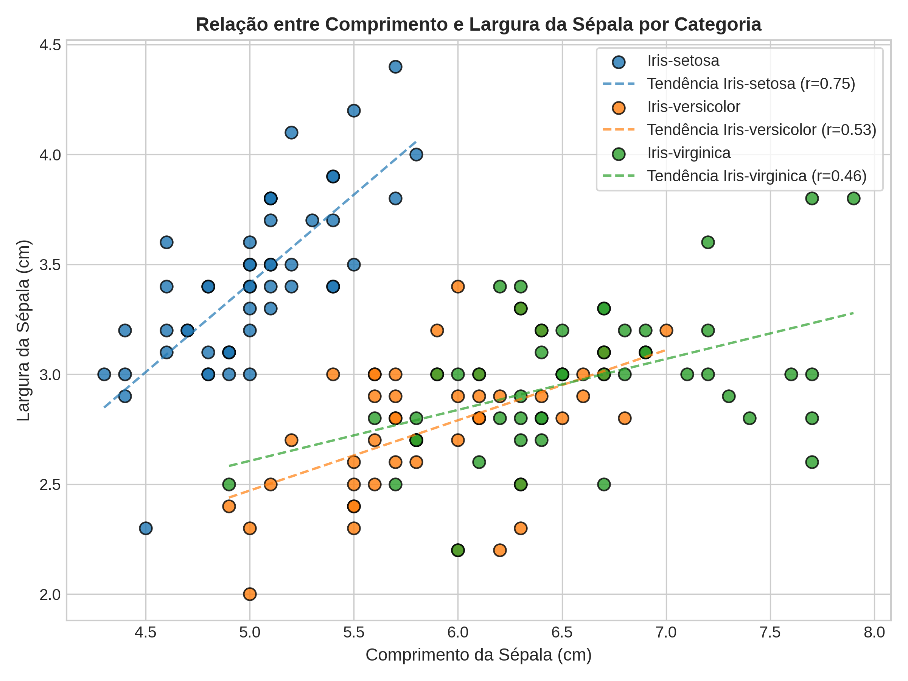
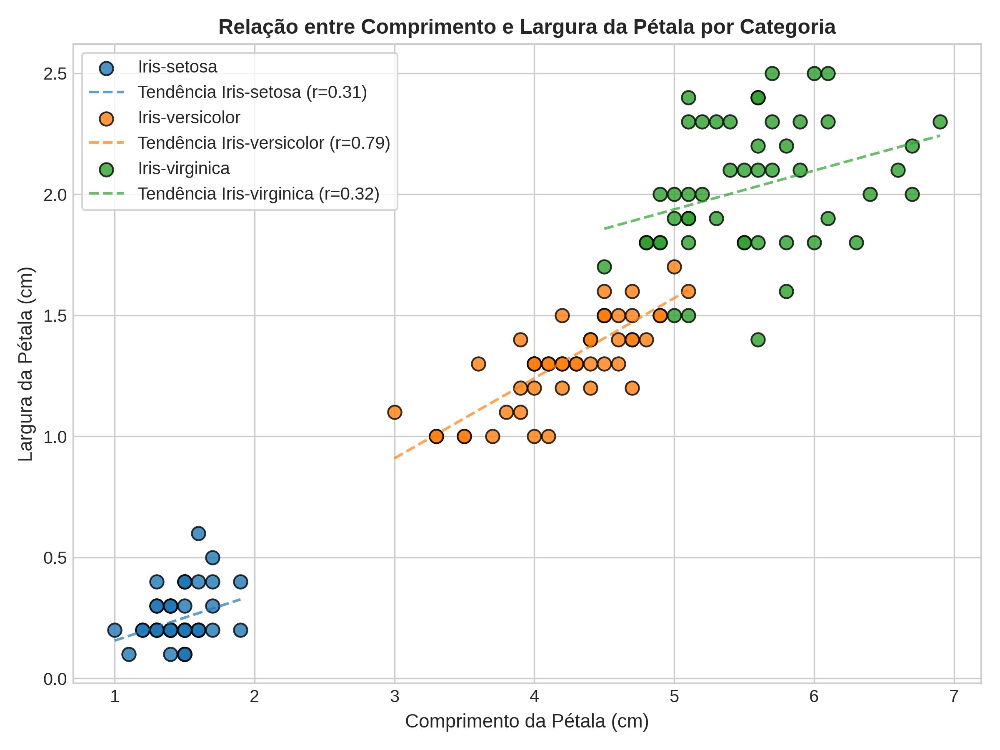
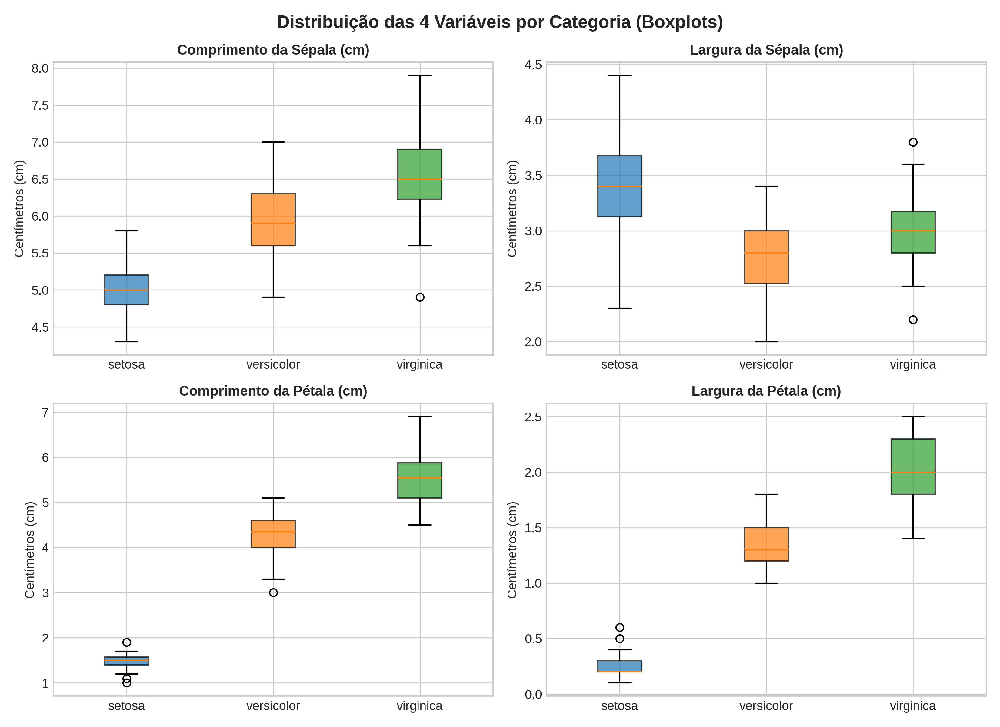
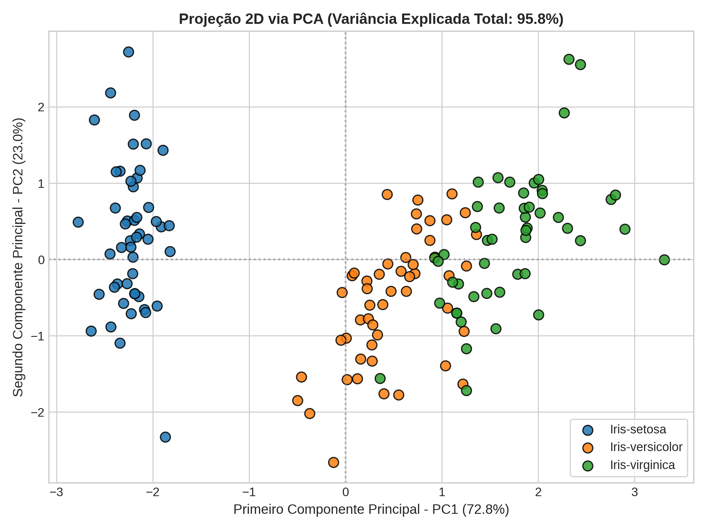
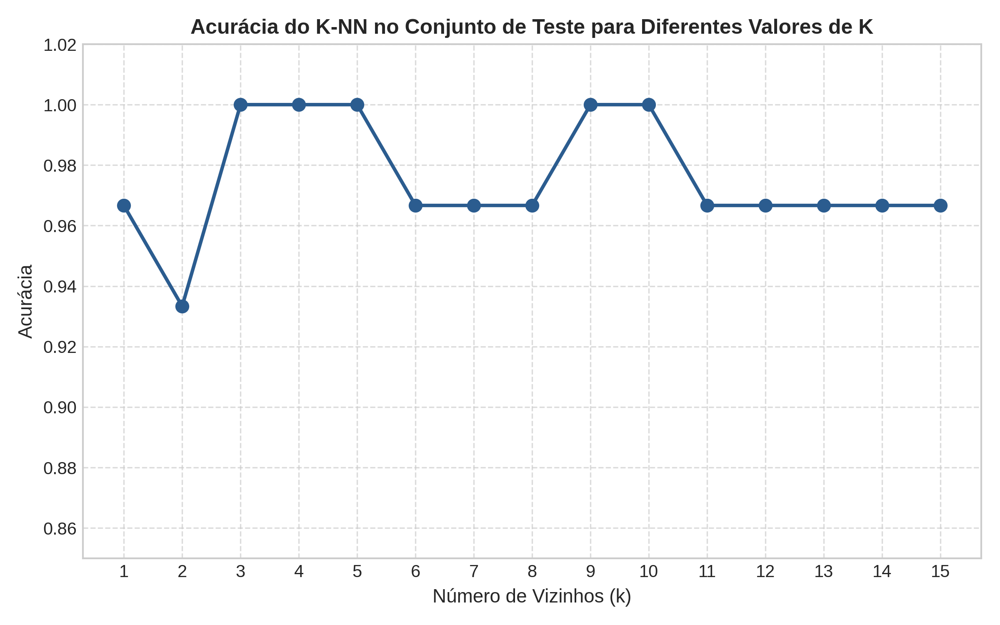
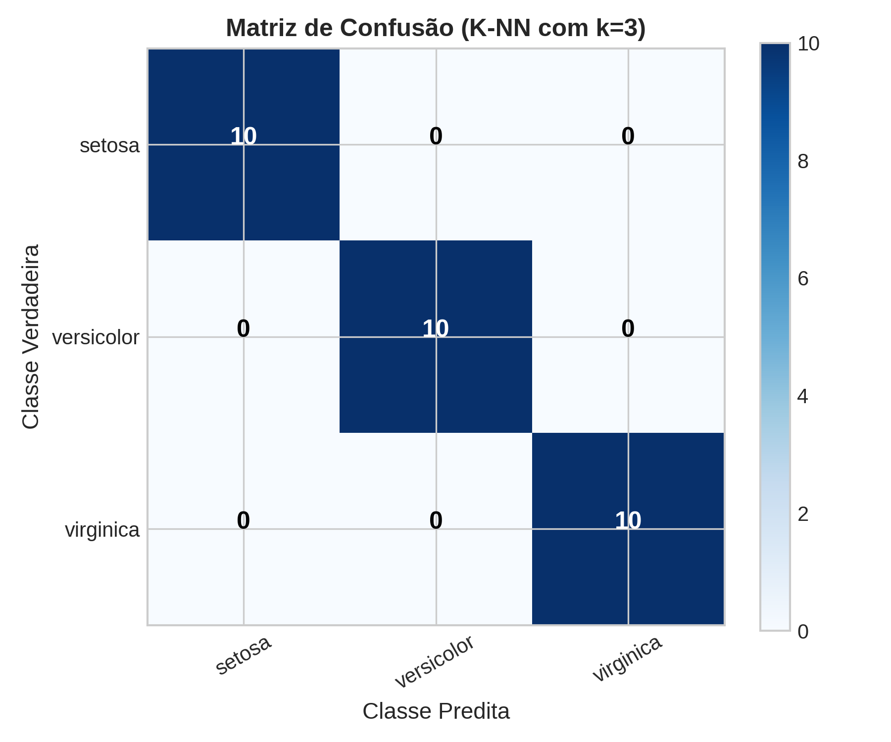

# TP4 — Análise Exploratória, PCA e Classificação K-NN no Dataset Iris

**Disciplina:** Visão Computacional / Aprendizado de Máquina  
**Repositório Git:** [https://github.com/GAFS-GAFS/Vis-oComputacional](https://github.com/GAFS-GAFS/Vis-oComputacional)

### Integrantes:
- Gabriel Augusto Fabri Soltovski GRR20222546
- Ricardo Quer GRR20224827

---

## 1. Visão Geral do Dataset
O dataset [Iris](iris/iris.data) é composto por **150 amostras** divididas igualmente em 3 classes (50 de cada, ou seja, 33,33% por classe):
1. *Iris setosa*
2. *Iris versicolor*
3. *Iris virginica*

Atributos mensurados (em cm):
- Comprimento da sépala (`comp_sepala`)
- Largura da sépala (`larg_sepala`)
- Comprimento da pétala (`comp_petala`)
- Largura da pétala (`larg_petala`)

---

## 2. Estatísticas Descritivas

| Atributo | Estatística Geral | Iris setosa | Iris versicolor | Iris virginica |
| :--- | :---: | :---: | :---: | :---: |
| **Comprimento da Sépala** | $5{,}84 \pm 0{,}83$ (Moda: 5,0) | $5{,}01 \pm 0{,}35$ (Moda: 5,0) | $5{,}94 \pm 0{,}52$ (Moda: 5,5) | $6{,}59 \pm 0{,}64$ (Moda: 6,3) |
| **Largura da Sépala** | $3{,}05 \pm 0{,}43$ (Moda: 3,0) | $3{,}42 \pm 0{,}38$ (Moda: 3,4) | $2{,}77 \pm 0{,}31$ (Moda: 3,0) | $2{,}97 \pm 0{,}32$ (Moda: 3,0) |
| **Comprimento da Pétala** | $3{,}76 \pm 1{,}76$ (Moda: 1,5) | $1{,}46 \pm 0{,}17$ (Moda: 1,5) | $4{,}26 \pm 0{,}47$ (Moda: 4,5) | $5{,}55 \pm 0{,}55$ (Moda: 5,1) |
| **Largura da Pétala** | $1{,}20 \pm 0{,}76$ (Moda: 0,2) | $0{,}24 \pm 0{,}11$ (Moda: 0,2) | $1{,}33 \pm 0{,}20$ (Moda: 1,3) | $2{,}03 \pm 0{,}27$ (Moda: 1,8) |

---

## 3. Gráficos Gerados

| Relação da Sépala | Relação da Pétala |
| :---: | :---: |
|  |  |

| Distribuição nas 4 Dimensões (Boxplots) | Projeção 2D via PCA |
| :---: | :---: |
|  |  |

| Curva de Acurácia do K-NN ($k$) | Matriz de Confusão ($k=3$) |
| :---: | :---: |
|  |  |

---

## 4. Análise de Componentes Principais (PCA)
- **PC1:** 72,77% da variância total
- **PC2:** 23,03% da variância total
- **Variância Explicada Total:** **95,80%**
- **Conclusão PCA:** A redução para 2D preserva quase toda a informação, evidenciando que a *Iris setosa* é linearmente separável das demais e que *Versicolor* e *Virginica* formam clusters densos e bem delimitados.

---

## 5. Classificação Supervisionada com K-NN (80/20)
- **Divisão:** 120 amostras para treino (80%) e 30 amostras para teste (20% - 10 por classe).
- **Acurácia Obtida ($k=3$):** **100%** (30/30 acertos no conjunto de teste).
- **Precisão / Recall / F1-Score:** 1,00 para todas as classes.

---

## 6. Como Executar

Estando dentro da pasta `tp4`:

```bash
python3 main.py
```

O script recalculará todas as estatísticas, imprimirá os resultados no terminal e salvará todas as figuras na pasta `graficos/`.

Para compilar o relatório em PDF, utilize o arquivo [`relatorio.tex`](relatorio.tex) no Overleaf ou via compilador TeX local.
