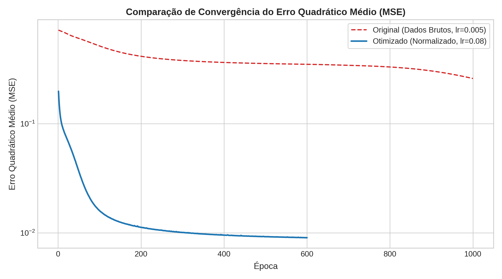
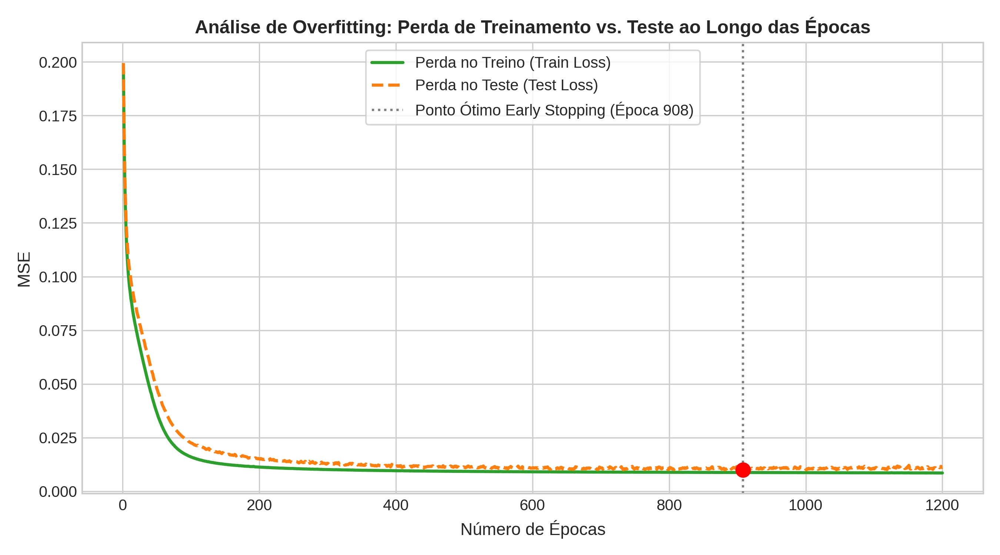
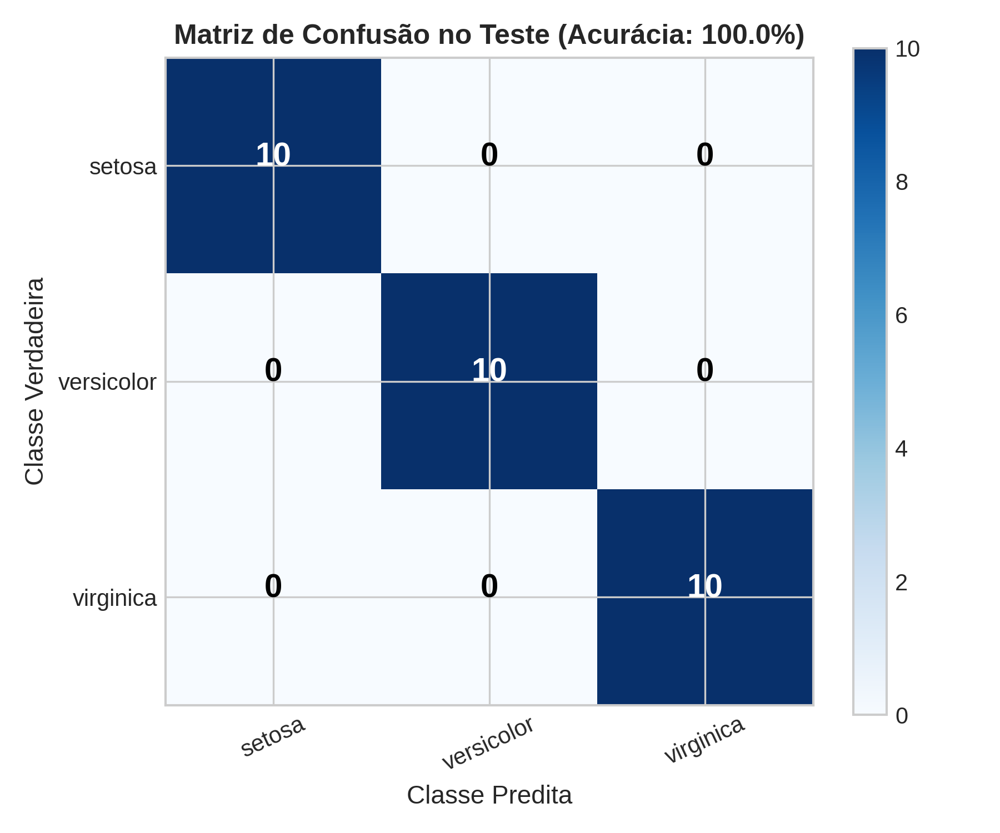
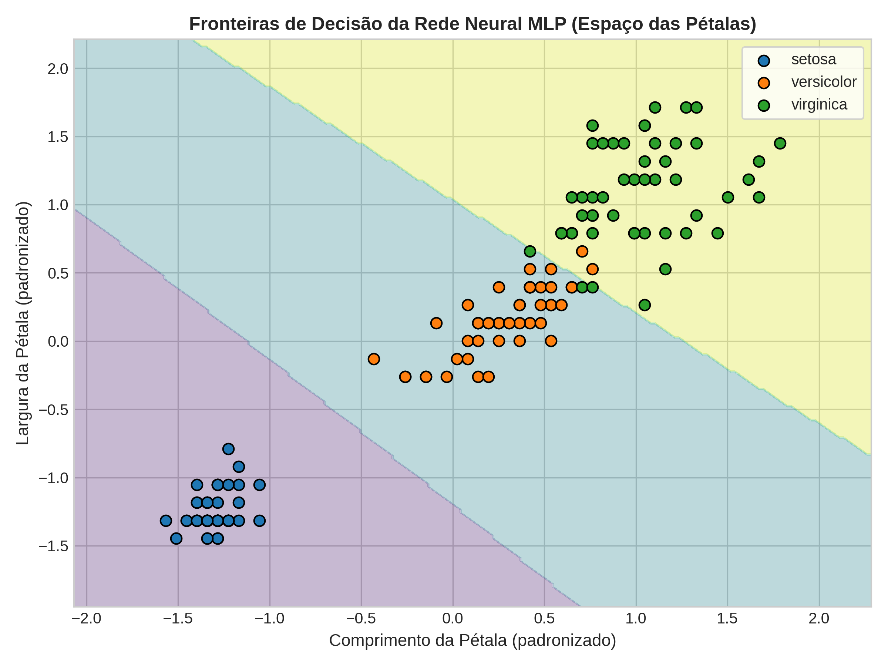

# TP5 — Estudo, Depuração e Experimentos com MLP from Scratch no Dataset Iris

**Disciplina:** Visão Computacional / Aprendizado de Máquina  
**Repositório Git:** [https://github.com/GAFS-GAFS/Vis-oComputacional](https://github.com/GAFS-GAFS/Vis-oComputacional)  
**Notebook Original:** [Google Colab - Multi-Layer Perceptron from Scratch](https://colab.research.google.com/drive/19gTFcbqcULM9NBX3Z9a8lE10P_Ju5mG_?usp=sharing)

### Integrantes:
- Gabriel Augusto Fabri Soltovski GRR20222546
- Ricardo Quer GRR20224827

---

## 1. Resumo do Trabalho

Este projeto consiste na análise detalhada, depuração de erros e condução de experimentos sobre a implementação de uma rede neural **Multi-Layer Perceptron (MLP) desenvolvida do zero (from scratch)** em Python/NumPy, aplicada à classificação das 3 classes do dataset Iris.

### Principais Bugs Diagnosticados e Corrigidos:
1. **Omissão da ativação no `predict()`:** Na implementação original, a predição fazia apenas a combinação linear (`forward = np.matmul(X, W_hidden) + b_hidden`), sem aplicar `sigmoid`, o que rebaixava a acurácia para **66,67%**.
2. **Ausência de Normalização dos Atributos:** Dados brutos entre 0,1 e 7,9 causavam saturação da sigmoide e gradientes evanescentes (*vanishing gradient*).
3. **Ordem Incorreta no Backpropagation:** A matriz de pesos de saída era atualizada antes do cálculo do gradiente da camada oculta.
4. **Ineficiência por Loops Escalares:** A implementação original usava listas aninhadas em Python com loops escalares lentos em vez de operações matriciais vetorizadas em NumPy.

---

## 2. Resultados Comparativos de Depuração

| Modelo Avaliado | Acurácia no Teste | Épocas para Convergência | Comportamento |
| :--- | :---: | :---: | :--- |
| **1. Código Original do Colab** | 66,67% | > 1000 | Confunde *Versicolor* e *Virginica* por ausência de ativação no `predict` |
| **2. Código com `predict` Corrigido** | 96,67% | ~800 | Melhora substancial, mas com convergência lenta devido aos dados brutos |
| **3. Modelo Otimizado (Normalizado + Vetorizado)** | **100,00%** | **~300** | Separação perfeita das 3 classes e convergência rápida |

---

## 3. Gráficos Gerados

| Convergência do MSE | Perda Treino vs. Teste (Overfitting) |
| :---: | :---: |
|  |  |

| Matriz de Confusão no Teste (100%) | Fronteiras de Decisão (Pétalas) |
| :---: | :---: |
|  |  |

---

## 4. Estrutura dos Arquivos

```text
tp5/
├── main.py                    # Script executável de benchmark e geração de gráficos
├── notebook_mlp_iris.ipynb    # Jupyter Notebook completo pronto para entrega/Colab
├── relatorio.tex              # Relatório sucinto e direto em LaTeX
├── README.md                  # Resumo do projeto
└── graficos/                  # Figuras geradas
    ├── 01_convergencia_mse.png
    ├── 02_overfitting_treino_teste.png
    ├── 03_matriz_confusao_mlp.png
    ├── 04_evolucao_pesos.png
    └── 05_fronteiras_decisao.png
```

---

## 5. Como Executar

### Execução via Linha de Comando:
```bash
python3 tp5/main.py
```

### Execução do Notebook:
Abra o arquivo [`notebook_mlp_iris.ipynb`](notebook_mlp_iris.ipynb) no Jupyter Notebook, VS Code ou faça upload no [Google Colab](https://colab.research.google.com).
